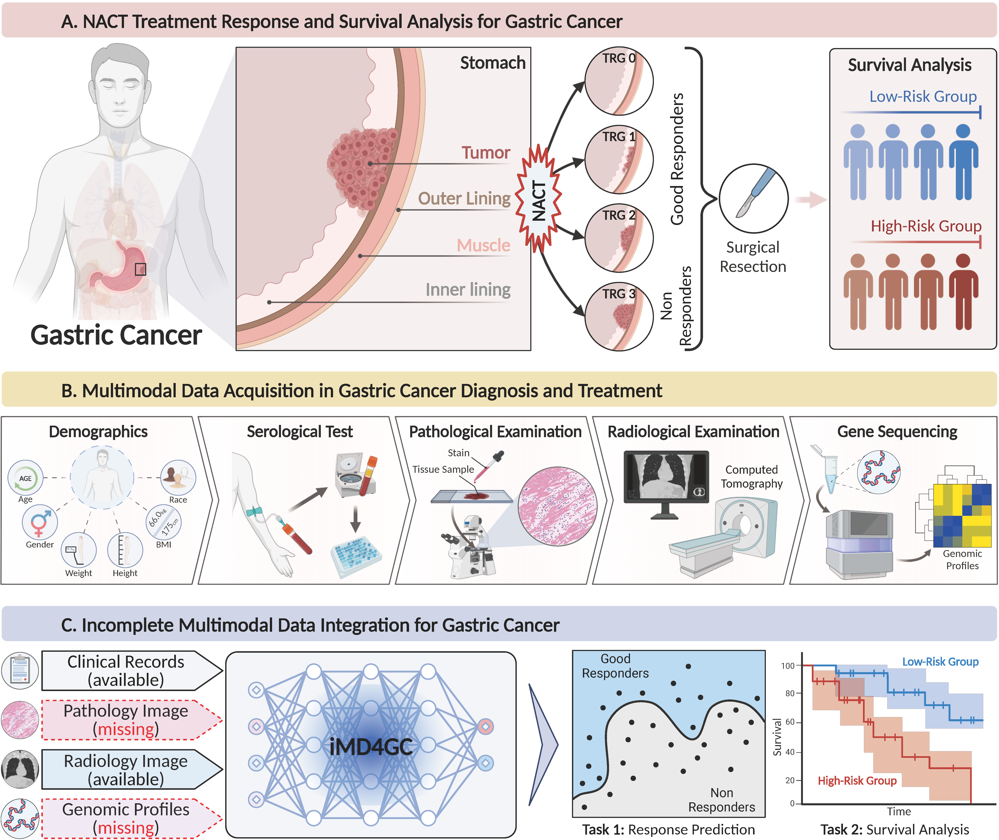

iMD4GC: Incomplete Multimodal Data Integration to Advance Precise Treatment Response Prediction and Survival Analysis for Gastric Cancer
===========
<details>
<summary>
  <b>iMD4GC: Incomplete Multimodal Data Integration to Advance Precise Treatment Response Prediction and Survival Analysis for Gastric Cancer. (Under Review)</b>
  <br>
    <a href="https://scholar.google.com/citations?user=neX6hWsAAAAJ">Fengtao Zhou</a>,
    <a href="https://scholar.google.com/citations?user=XY6NCLMAAAAJ">Yingxue Xu</a>,
    <a href="javascript:void(0)">Yanfen Cui</a>,
    <a href="javascript:void(0)">Shenyan Zhang</a>,
    <a href="javascript:void(0)">Yun Zhu</a>,
    <a href="javascript:void(0)">Weiyang He</a>,
    <a href="https://scholar.google.com/citations?user=OIWfp-QAAAAJ">Jiguang Wang</a>,
    <a href="https://scholar.google.com/citations?user=KJSLMFAAAAAJ">Xin Wang</a>,
    <a href="https://orcid.org/0000-0001-9267-0076">Ronald Chan</a>,
    <a href="https://scholar.google.com/citations?user=P6BtCOAAAAAJ">Louis Ho Shing Lau</a>,
    <a href="https://scholar.google.com/citations?user=q08QlVgAAAAJ">Chu Han</a>,
    <a href="javascript:void(0)">Dafu Zhang</a>,
    <a href="https://scholar.google.com/citations?user=O2VHAMIAAAAJ">Zhenhui Li*</a>,
    <a href="https://scholar.google.com/citations?user=Z_t5DjwAAAAJ">Hao Chen*</a>
  </br>
</summary>
</details>

<div align="center">
  
</div>

<details>
  <summary>
	  <b>Key Ideas & Main Findings</b>
  </summary>

1. **Background:** Gastric cancer (GC) is a prevalent malignancy worldwide, ranking as the fifth most common cancer with over 1 million new cases and 700 thousand deaths in 2020. Locally advanced gastric cancer (LAGC) accounts for approximately two-thirds of GC diagnoses, and neoadjuvant chemotherapy (NACT) has emerged as the standard treatment for LAGC. However, the effectiveness of NACT varies significantly among patients, with a considerable subset displaying treatment resistance. Ineffective NACT not only leads to adverse effects but also misses the optimal therapeutic window, resulting in lower survival rate. Hence, it is crucial to utilize clinical data to precisely predict treatment response and survival prognosis for GC patients.
2. **Multimodal Learning for Gastric Cancer Analysis:** Existing methods relying on unimodal data falls short in capturing GC's multifaceted nature, whereas multimodal data offers a more holistic and comprehensive insight for prediction. However, existing multimodal learning methods assume the availability of all modalities for each patient, which does not align with the reality of clinical practice. The limited availability of modalities for each patient would cause information loss, adversely affecting predictive accuracy.
3. **Incomplete Multimodal Data Integration Framework for Gastric Cancer:** In this study, we propose an incomplete multimodal data integration framework for GC (iMD4GC) to address the challenges posed by incomplete multimodal data, enabling precise response prediction and survival analysis. Specifically, iMD4GC incorporates unimodal attention layers for each modality to capture intra-modal information. Subsequently, the cross-modal interaction layers explore potential inter-modal interactions and capture complementary information across modalities, thereby enabling information compensation for missing modalities. To enhance the ability to handle severely incomplete multimodal data, iMD4GC employs a ``more-to-fewer'' knowledge distillation, transferring knowledge learned from more modalities to fewer ones.
4. **Datasets:** To evaluate iMD4GC, we collected three multimodal datasets for GC study: GastricRes (698 cases) for response prediction, GastricSur (801 cases) for survival analysis, and TCGA-STAD (400 cases) for survival analysis. The scale of our datasets is significantly larger than previous studies.
5. **Experimental Results:** The iMD4GC achieved impressive performance with an 80.2\% AUC on GastricRes, 71.4\% C-index on GastricSur, and 66.1\% C-index on TCGA-STAD, significantly surpassing other compared methods. Moreover, iMD4GC exhibits inherent interpretability, enabling transparent analysis of the decision-making process and providing valuable insights to clinicians. Furthermore, the flexible scalability provided by iMD4GC holds immense significance for clinical practice, facilitating precise oncology through artificial intelligence and multimodal data integration.
</details>

## Updates / TODOs
Please follow this GitHub for more updates.
- [ ] Source code for reproducing experimental results on GastricRes dataset.
- [ ] Source code for reproducing experimental results on GastricSur dataset.
- [x] Source code for reproducing experimental results on TCGA-STAD dataset.

## Installation
To install dependencies, 
```bash
torch 1.12.0+cu116
scikit-survival 0.19.0
```

## Datasets
To evaluate iMD4GC, we collected three multimodal datasets for GC study: GastricRes (698 cases) for response prediction, GastricSur (801 cases) for survival analysis, and TCGA-STAD (400 cases) for survival analysis.
- **GastricRes**: This dataset was collected from four prominent medical hospitals in China. This dataset encompasses comprehensive information from 698 patients who were diagnosed with gastric cancer and underwent Neoadjuvant Chemotherapy (NACT) treatment. The dataset consists of three modalities: clinical records, whole slide images (WSI), and computed tomography images (CT). 
- **GastricSur**: This dataset was collected from two prominent medical hospitals in China. It comprises comprehensive data from a cohort of 801 patients who were diagnosed with gastric cancer and subsequently underwent surgical resection. Similar to the GastricRes dataset, this collection encompasses three distinct modalities: clinical records, whole slide images (WSI), and computed tomography scans (CT). Throughout the follow-up period, there are 286 patients who died.
- **TCGA-STAD**: Add weakly-supervised results for Tensorboard. This dataset was obtained from The Cancer Genome Atlas (TCGA) database. It contains data from 400 patients diagnosed with gastric cancer. Different from GastricRes and GastricSur datasets, the modalities involved in this dataset are: clinical records, WSI, and RNA-seq. The clinical records are downloaded from the <a href="https://linkedomics.org/data_download/TCGA-STAD/">LinkedOmics</a>. The WSI are downloaded from the <a href="https://portal.gdc.cancer.gov/">GDC Data Portal</a>. The RNA-seq data is downloaded from the <a href="https://www.cbioportal.org/">cBioPortal</a>. Specifically, all patients in this dataset have clinical records, while 363 patients have WSI and 374 patients have RNA-seq.

The first two datasets are not publicly released due to restrictions by privacy concern, but they are available from the corresponding author on reasonable request. The TCGA-STAD dataset is publicly available at <a href="https://portal.gdc.cancer.gov/">GDC Data Portal</a>. The formatted data of TCGA-STAD is available at <a href="https://hkustconnect-my.sharepoint.com/:f:/g/personal/fzhouaf_connect_ust_hk/ElYrNphQdy9GrPvkalfqIr4BMx7s8EQk3EsLIEcEizFGhA?e=Cbr1fn">OneDrive</a>, which can be used to reproduce the results in this study.

## Acknowledgments
This work was supported by National Natural Science Foundation of China (No. 62202403, 82001986, and 82360345), Hong Kong Innovation and Technology Fund (No. PRP/034/22FX), Shenzhen Science and Technology Innovation Committee Funding (Project No. SGDX20210823103201011), the Research Grants Council of the Hong Kong Special Administrative Region, China (Project No. R6003-22 and C4024-22GF).

